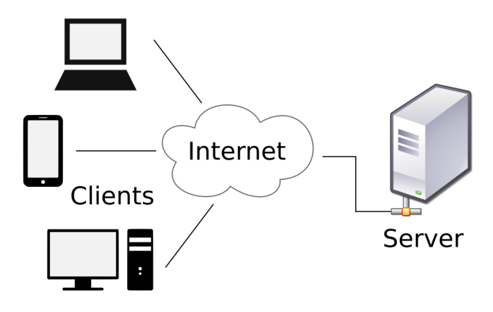

# Web Fundamentals

Before starting, it is important to familiarize yourself with the terminology frequently used in the web development field. Terms like: the internet, the web, client, server, protocols, API, database ...etc.

## Network

We use the word "network" to describe a group of two or more computer machines or devices (such as smart phone devices) that are connected to each other using either a wire technology (such as ethernet cable) or wireless technology (such as WiFi).

There are two types of networks:

* **Local-Area Network (LAN)**: which describes one or more computer machines or devices that are connected to a router.
* **Wide-Area Network (WAN):** which describes two or more LANs connected to each other. For example: connecting two or more routers to each other forms a WAN, because the router is used to connect a LAN to another LAN.

## The internet

The internet is just a massive WAN that connects computer machines and devices around the world to each other.

## Internet Service Provider (ISP)

Is the company that provides you with an internet service. You can't directly connect your computer to the internet. You must first have a subscription with some ISP to be able to connect to the internet.

## The web

The web is a part of the internet which represents resources such as web pages, videos, images, ..etc, that can be accessed using some special programs (applications) such as the browser.

## The browser

The browser is just a program (application) that you use to access the web. The commonly used browsers are:

* Google Chrome
* Mozilla Firefox
* Internet Explorer
* Microsoft Edge
* Safari
* Opera

## Web Architecture

The Web can be summarized as a series of interactions between two types of systems, **clients** and **servers**.

## Server

A server is any computer machine or program that provides services or resources to other computers or programs.

For example, when you develop a website and you want to publish it so people around the world can access it, you need to use a server to host your website.

Some common types of servers:

* Web servers: which are used to host websites.
* Email servers: which are used to provide email service.
* Virtual Private Servers: which are virtual computer machines that you can build and use over the cloud (online).

## Client

A client is any computer machine or program that consumes services or resources from another computer machine or program.

Examples:

* The computer you use to access the web.
* The browser you use to access computer.

## Protocols

Computers connected over a network need some way to communicate with each others. They need a set of rules which when followed a successful communication can be made. These set of rules which computers over a network follow to make a successful communication are called protocols.

So, network protocols are a set of rules, conventions, and data structures that dictate how devices exchange data across networks.

### HyperText Transfer Protocol (HTTP)

Computers use a protocol called **HTTP** protocol to access the web.

You need to remember this protocol very well, because it is what you will be dealing with when building websites and web applications.

When you access a website:

* Your computer sends something called **HTTP Request**, which is a message that your computer sends to the server that hosts the website you want to access. This message includes information such as the type of the requested resource (file), and the path to the requested resource (file).
* When the server receives the request, it prepares what is know as **HTTP Response** to be sent back to your computer. This response contains the resource (file) you requested (for example, the web page you requested).

The HTTP request contains different types of methods (verbs) to pick out the desired action from the server. The most common methods are:

* **GET**: Retrieves data from the server.
* **POST**: Submits data to the server.
* **PUT** / **PATCH**: Updates data on the server.
* **DELETE**: Deletes data from the server.

You will learn more about the HTTP request and the HTTP response and how to use HTTP methods later in this course.

### Internet Protocol (IP)

Each computer on a network whether it is a LAN or WAN must have an identifier (**IP Address**), which is used for routing and addressing packets of data so that they can travel across networks and arrive at the correct destination.

The idea of this protocol is similar to the idea of the addressing system used for houses. Imagine that you make a purchase order from Amazon. You need to provide them with your house address so they know where to deliver the package.

Same idea applies to computers. When the data is sent from one computer to another, it uses this protocol (the IP protocol) to know its destination.

### Transmission Control Protocol (TCP)

IP protocol does not establish the connection or define the ordering of the packets of data transmitted. These aspects are handled by the Transmission Control Protocol (TCP), which works in agreement with the Internet Protocol to transfer data between systems on the Internet.

For this reason, connections between Internet-connected systems are often called "TCP/IP" connections.

To summarize:

* **IP**: is responsible for describing **where** the data is going.
* **TCP**: is responsible for describing **how** the data should be transmitted.

### Dynamic Host Configuration Protocol (DHCP)

DHCP is a protocol that automatically assigns a unique IP address to each device that connects to a network.

For example, when you connect your computer to a router or to a WiFi network, the router uses the DHCP to automatically assign a unique IP address to your computer.

## Domain names

Domain names are just aliases for IP addresses.

When you access a website you usually use the domain name to access the website. By doing that you are sending an HTTP request to the server that has this domain name. However, instead of using the domain name to access the website, you can use the IP address to access the website.

For example you can access google website by writing `google.com` or by writing `172.217.21.46` in the address bar of your browser.

People prefer using domain names because they are prettier and easier to remember. Your computer simply converts the domain name to its corresponding IP address and use the IP address to communicate.

## Domain Name System (DNS)

For your computer to convert the domain name to an IP address it uses a service called **DNS**. However, when your computer can't figure out the IP address by itself it asks the DNS servers on the internet for help. The DNS server acts as a directory that a computer consults when accessing another computer over a network.

## Servers and API

API stands for Application Programming Interface. It is a software intermediary that allows two applications to speak to each other. Web APIs are APIs that can be accessed using the HTTP protocol.

Let's use a metaphor to simplify the concept of the API. Imagine you are sitting at a table in a restaurant with a menu and you’re about to order. The kitchen is the part of the "system" that will prepare your order. The missing link here is the one that will communicate your order to the kitchen and deliver your food to your table. This is where the server or API comes in. The waiter is the messenger (an API) who takes your request or order and tells the kitchen (the system) what to do. Then the server brings you the answer; in this case, it's food.

APIs are data-driven, which means they use data to describe the actions that need to be performed instead of using programming logic such as functions (you will learn more about this later in the course).

> Don't worry if you still don't understand what an API is. We will talk more about it later is this course.

### Types of APIs

There are four major types of APIs:

* **Open APIs**: 
    * open to public (external users) with minimal restrictions.
    * using them may require registration (subscription).
    * when you register, you often use some kind of credentials to access the API such as (username, password, and an API key)

* **Internal APIs**: 
    * Is hidden from external users (available for the company employees only).

* **Partner APIs**:
    * Open APIs with restricted access.
    * Shared only with business partners who have signed an agreement with the publisher of the API.

* **Composite APIs**: 
    * Allow access to several endpoints in one call.
    * Are useful in microservice architectures (where a user may need information from several services to perform a single task).

## Web Service APIs

Besides the main web APIs, there are also web service APIs :

* SOAP
* XML-RPC
* JSON-RPC
* REST (also know as RESTful API)

In this course we will focus on the REST API. For example, we will use a framework called `express` to build a RESFul API.

## Database

Website or any other application usually deals with data. For example, when a user register in a website, the user fills a registration form with his name, email, and password. This data needs to be stored somewhere in a specifically organized way. This is where tha database comes into play.

A **database** is a collection of information stored in an organized way so that it can be easily accessed, managed and updated.

There are may different types of databases (ways of storing data):

* Relational databases.
* Object-oriented databases.
* Distributed databases.
* Data warehouses.
* NoSQL databases.
* Graph databases.
* OLTP databases.

We will talk more about databases later in this course.

### Database Management System (DBMS)

As the name suggests, the DBMS is a system used to manage databases. A DBMS serves as an interface between the database and its end users or programs, allowing users to retrieve, update, and manage how the information is organized and optimized.

## What is web development?

Web development is the process of building websites and applications for the Internet, or a private network known as an Intranet.

Web development is not only concerned with the design of a website. It’s also about the coding and programming that powers the website’s functionality.

From the simplest, most static web pages to social media platforms and applications and from E-commerce websites to content management systems (CMS), all the tools we daily use via the Internet have been built by web developers.

Web development can be broken down into three layers:

* Client-side coding (front-end)
* Server-side coding (back-end)
* Database technology.

## Types of web developers:

**Front-end Developer:**

Client-side scripting, or front-end development, refers to everything that the end user experiences directly. Client-side code is executed on a web browser and directly relates to what people see when they visit a website. Things like layout, fonts, colors, menus and contact forms are all designed by the frontend.

**Back-end Developer:**

Server-side scripting, or back-end development, is all about what goes on behind the scenes. The back end is essentially the part of a website that the user doesn’t see. It is responsible for storing and organizing data, and ensuring that everything on the client-side runs smoothly. It does this by communicating with the front end. Whenever something happens on the client-side, let’s say, a user fills out a form the browser sends a request to the server-side. The server-side “responds” with relevant information in the form of front-end code that the browser can then interpret and display.

**Full stack Developer:**

A full stack web developer is a person who can develop both client and server software.

In addition to mastering HTML and CSS, he/she also knows how to:

* Program a web page (like using JavaScript, jQuery, React, Angular, or Vue)
* Program a server (like using PHP, ASP.Net, Python, or Node.js)
* Program a database (like using MySQL, SQLite, or MongoDB)

## Creating a website

There are two ways of creating a website:

**Using a Content Management System (CMS)**: 

an easy-to-use system that allows you to control and manage the content within your website without necessarily having technical (programming) skills. 

Popular CMSs include:

* WordPress
* Joomla
* Drupal
* Magento
* PrestaShop
* Shopify

**Hard coding**: 

requires specific skills and knowledge of programming languages. That is the complex way to create a website and that is what web developers do.

In hard coding, you have the freedom to change what you want and build a custom website that completely satisfies the needs of the user, the employer, and the client.

## Create a website with code

For this course, we’ll need the following tools:

- A code editor to write code.
- A web browser to preview what we’re building.

While you can use any web browser or code editor, we recommend using Google Chrome browser and Visual Studio Code (VSCode) to write code for this course.

* Google Chrome can be downloaded from https://www.google.com/chrome/

* Visual Studio Code can be downloaded from https://code.visualstudio.com/

Make sure to have them installed on your computer because we are going to use them in the next lesson.

