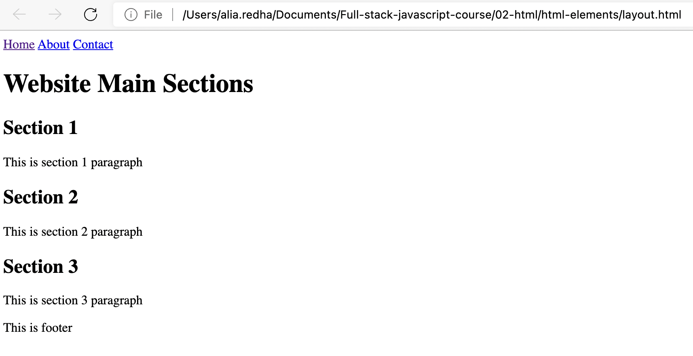

# HTML

In the previous lesson we talked about the difference between front-end development and back-end development. To refresh your memory:

* **Front-end development**: is the practice of using Languages and scripts that can be understood and executed by the browser. We use these languages to build the user interfaces (the web pages that the end-user (the website visitor) can see and interact with). The languages we use for front-end are exclusively: HTML, CSS and JavaScript.

* **Back-end development**: is the practice of using tools and languages that runs on the server to perform tasks such as uploading files, sending emails and reading from and writing to the database. There are many programming languages that can be used for back-end development including: JavaScript, PHP, C#, Python, Ruby ...etc. The one we are going to use in this course is JavaScript.

In this lesson, and the next few lessons we will be focusing on the languages that are used for front-end development.

## Front-end languages:

* **HyperText Markup Language (HTML)**: is used for building the page layout and adding content to the web page such as texts, images, audios, videos, tables, forms, hyperlinks, and buttons. HTML is not considered a programming language, instead it is know as a markup language. In this lesson you will learn about HTML, what it does, and how it is used.

* **Cascading Style Sheet (CSS)**: is used for styling the web page by fixing the spacing between the page elements, changing the text type, size and colour, changing the background colours of the different sections and arranging the the elements in more proper positions on the page. CSS is also not considered a programming language.

* **JavaScript**: is a programming language used to make the web page interactive. Meaning, user can interact with the elements in the page and perform actions on them such as showing a popup window when the user click on a button on the page.

## Build your first website using HTML

In this lesson you will learn how to build a simple website using only HTML.

First you need to understand that a website is no more than a folder that contains a bunch of related files such as fonts, images, HTML files, CSS files, JavaScript files ... etc. So, we usually start by creating an empty folder to which we gradually add these kinds of files as we build the website.

As we are going to practice building many websites and web applications in this course I highly encourage you to create a folder called `full-stack-js-course` and include all your projects in it. I also recommend that you create a new folder inside `full-stack-js-course` folder called `assignments` to put all your assignments in one place so you can easily get back to them when you need in the future.

Now, inside the `full-stack-js-course` folder, create a folder called `my-first-website`. This folder will contain the files of the website that we are going to build in this lesson.

### Opening the folder in VSCode

In the previous lesson, we asked you to download and install a code editor called Visual Studio Code. If you did not download and install it yet go ahead and download it at https://code.visualstudio.com/download

Once you have it installed, go ahead and open and you should see a welcome screen.

Close the welcome screen tab and you should see an interface similar to the one shown in the following figure:


You can notice that there is a list of some shortcuts which you can use to open files and folders or creating a new file. If you are using Windows instead of Mac your shortcuts might be a bit different than mine.

Go ahead and open the `my-first-website` folder that we just created a few seconds ago either by using these shortcuts or from the menu bar by selecting:

File -> Open...

Or if your are using Windows:

File -> Open folder


### Creating your first HTML file

Notice that in the `EXPLORER` area appears the `MY-FIRST-WEBSITE` folder which represents the project folder. The folder is currently empty, however when you move the mouse cursor inside the `EXPLORER` area, four icons will appear next to the folder name. These icons allow you to create New File, New Folder, Refresh Explorer and Collapse Folders in Explorer. The ones you will frequently use are New File and New Folder to create files and folders inside the project folder (`my-first-website` folder).

Click on the New File icon to create a new file and call it `index.html`. 

### Understanding file extensions

It is important to know that files on computers have extensions. These extensions determine the types of these files. In our case, the extension of the `index.html` file is `.html`, which means it is a file of type HTML, while `index` is just the name of the file.

Other examples:

* Word Documents or Google Docs have the extension: `.doc` or `.docx`
* Excel Sheets have the extension: `.xls` or `.xlsx`
* PDF files have the extension: `.pdf`
* Images have different extensions based on the type of the image: `.png`,`.jpg`, `.jpeg` or `.gif` ... etc.

### Writing your first code

Double-click on the `index.html` file that you just created. You will notice a new tab window will open which has the name of the file as its title. Inside this window you can write your code.

Write the following HTML code:

```html
<!DOCTYPE html>
<html>
<head>
    <meta charset="UTF-8">
    <title>My First Website</title>
</head>
<body>
    <h1>Hello World!</h1>
    <p>This is my first website.</p>
</body>
</html>
```

Press `command` + `S` (if you are using Mac) or `ctrl` + `S` (if you are using Windows) to save the file.

Now open the folder that contains the `index.html` file and double-click the file. In case it asks you which program to use to open the file select your preferred browser (for example Google Chrome). You should see a web page similar to the one shown in the figure below:


## Introduction to HTML

In the previous you saw how an HTML code looks like. It is important to understand HTML and to know how to use it in order to build web pages. The web page we just built is a very simple page which only has a title and a single paragraph. In real life projects web pages are much more complex and contains more elements.

### HTML Elements

The HTML language is formed of what are know as HTML elements. These elements are used to compose (build) the web pages. For example, in the previous code we used the **heading element** to add the "Hello World!" heading to the page. We also used the **paragraph element** to add "This is my first website." paragraph to the page.

There are so many more HTML elements that we can use to add more types of content to the page. There are also other HTML elements that we can use to create the layout of the web page by dividing it into various sections.

### HTML Tags

HTML elements are represented by what are know as HTML tags. For example, the heading element is represented by the `<h1>` tag, and the paragraph element is represented by the `<p>` tag.

> There are other types of headings including `<h2>`, `<h3>`, `<h4>`, `<h5>` and `<h6>`.

HTML elements are either **paired tags** elements (represented by a single tag) or **unpaired tag** elements (represented by two tags, an opening tag and a closing tag).

### Paired tags

The following elements are examples of the paired tags elements:

```html
<title>My First Website</title>
```

The opening tag is `<title>` and the closing tag is `</title>`

```html
<h1>Hello World!</h1>
```

The opening tag is `<h1>` and the closing tag is `</h1>`

```html
<p>This is my first website.</p>
```

The opening tag is `<p>` and the closing tag is `</p>`

> Pay attention to the slash (`/`) in the closing tags.

### Unpaired tag

The following element is an example of the unpaired tag element:

```html
<meta charset="UTF-8">
```

As you can notice this element is formed of only one tag (it has no closing tag).

Another example of the unpaired tag is the `` tag which we use to add an image to the web page.

```html

```

It is totally fine if you don't understand what these tags are or how they are used. All you need to know for now is that HTML elements are either paired tags or unpaired tag elements.

## Fundamental HTML elements

Let's try to understand the previous code in more depth by analyzing it line by line.

### DOCTYPE element

The `DOCTYPE` element is called "document type declaration". It allows us to declare the document as an HTML document and also identifies the version of HTML used for writing the document.

The current version of the HTML language is the version 5, and to declare the document as an HTML document that uses the version 5, we add the following tag in the very beginning of our code:

```html
<!DOCTYPE html>
```

> Don't miss to the exclamation mark (`!`) at the beginning of the tag.

It is important to add this tag, because if we don't add it the browser might not render the page properly (converts the HTML code into visible page properly). 

### HTML element

The HTML element (`<html>`) determines the beginning and the ending of the HTML document. Anything goes between the `<html>` and the `</html>` is considered a part of the HTML document.

The HTML document is structured with two main elements: the `head` and the `body`. Every HTML document, no matter how simple or complex it is, must have these two elements.

### Head element

Identifies the head of the HTML document. Inside the head (between the `<head>` and the `</head>`), we add elements that provides information about the page to the browser such as:

* the title of the page
* the favicon of the website (an icon version of the website logo)
* the stylesheets used by the page (CSS files)
* the encoding system used to encode the text in the page (we usually use `utf-8`)
* and more...

This part of the HTML document is not visible to the end-user (the website visitor). However, it is necessary so the browser knows how to treat the document.

The HTML document we created previously included the head as following:

```html
<head>
    <meta charset="UTF-8">
    <title>My First Website</title>
</head>
```

Inside the head element you can notice that there are two elements:

* **the `<meta>` element**: which has multiple uses. In our case we are using it to define the encoding system that want to use to encode the textual content in the web page.

> Computers only understands 1s and 0s, and alphabet characters and numbers must be converted to 1s and 0s so the computer can understand them. The purpose of encoding systems is to do that. UTF-8 encoding system is the most commonly used system because it can encode the characters of almost all languages around the world as well as symbols and emojis.

* **the `<title>` element**: which contains the web page title that appears as a tab title when you open the web page.


### Body element

The body element always comes after the head element and identifies the body of the HTML document. Inside this element (between the `<body>` and the `</body>`) we add the content that the end-user will see on the page such as headings, paragraphs, images, forms, tables, ...etc.

The HTML document we created previously included the body as following:

```html
<body>
    <h1>Hello World!</h1>
    <p>This is my first website.</p>
</body>
```

## HTML Attributes

Consider the following examples:

```html
<meta charset="UTF-8">
```

```html

```

Noticed the `charset`, `src` and `alt` used in the `<meta>` and the `` elements?

These are called **HTML attributes**.

The purpose of HTMl attributes is to provide more information about the element. For example in the `` element we use the `src` attribute to define the path of the image (`src` is the attribute, and the `assets/images/my-image.png` is its value). We also use the `alt` attribute to show an alternative text in case the image does not load successfully (`alt` is the attribute, and the `My image` is its value).

Attributes usually follow the following syntax:

```
attribute-name="the value goes here"
```

Examples:

```js
src="images/my-image.jpg"
```

```js
href="profile.html"
```

```js
style="color: red;"
```

However, sometimes attributes are used without a value. Some examples will be shown later in this lesson.

> you can use either single quote `'` or double quotes `"` to wrap the value.

Don't worry if you don't know what some of these attributes does. The purpose of these examples is to show you the correct syntax of defining attributes.

> In paired tags elements, attributes are added in the opening tag.

### Global attributes

Some HTML attributes are **global attributes**, while others are not.

In HTML the term "global attributes" refers to a set of attributes that you can use on any HTML element. You can add these attributes to `<body>`, `<h1>`, `<p>` and all HTML elements.

Obviously, not all attributes are global. For example `href`, `width`, `height`, `src` ...etc. These attributes can be used only with some elements. For example you can use the `href` with the anchor element (`<a>`), but you can't use it with the paragraph element (`<p>`).

We will learn more about HTML attributes in this lesson and the next coming lessons.

## Building more complex website

Not let's learn about other useful HTML elements by building another yet more complex website.

The website we are going to build this time has three pages:

* home page
* about page
* contact page

1. Inside your `full-stack-js-course` folder create a new folder called `website-2` and open it with VSCode as you learned previously.

2. Add a new file called `index.html` to the project folder (`website-2` folder).

3. Double-click the `index.html` and start your code by adding the document type declaration tag, the html element, the head element and the body element as following:

```html
<!DOCTYPE html>
<html>
<head>
    <meta charset="UTF-8">
    <title>Website 2</title>
</head>
<body>
    
</body>
</html>
```

4. Add more two HTML files to the project folder: `about.html` and `contact.html`. As you might already guessed, the `about.html` will be used as the about page, while the `contact.html` will be used as the contact page.

6. Copy the same previous code to both files: the `about.html` and the `contact.html`.

7. In the `about.html`, change the title to the following:

```html
<title>Website 2 - About</title>
```

8. In the `contact.html`, change the title to the following:

```html
<title>Website 2 - Contact</title>
```

### Using hyperlinks

To navigate between pages we use what are know as hyperlinks. The HTML element responsible for creating hyperlinks is called **anchor element** (`<a>`). For example to create a hyperlink that navigates to the about page, we write the following code:

```html
<a href="about.html">About</a>
```

Notice that:

* The anchor element is a paired tags element (has opening and closing tags)
* The anchor element has an attribute called `href` which defines the path of the html file that represents the page to which we want to navigate.
* The text we put inside the anchor element will appear as an underlined blue text on the page and when clicked will navigate to the targeted page.

Of course we will learn how to change the style and the color of this text later when we start learning CSS.

### Lists in HTML

There are different types of lists that we can use in HTML. The two most commonly used are:

* Ordered list (`<ol>`): numbered bullet points
* Unordered list (`<ul>`): unnumbered bullet points

Let's see how we can use `<ol>` to create an ordered list of names:

```html
<ol>
    <li>Mohammed</li>
    <li>Fatima</li>
    <li>Ahmed</li>
</ol>
```

> The `<li>` is called the list item element.

This list will appear on the page as following:


You can use the `type` attribute on the `<ol>` to change the numbering type. For example, to use the Roman numerals you can use `type="I"` as following:

```html
<ol type="I">
    <li>Mohammed</li>
    <li>Fatima</li>
    <li>Ahmed</li>
</ol>
```

Now let's see how the `<ul>` looks compared to the `<ol>`:

```html
<ul>
    <li>Mohammed</li>
    <li>Fatima</li>
    <li>Ahmed</li>
</ul>
```

This list will appear on the page as following:


### Adding hyperlinks to website 2

We will use both the `<ul>` and the `<a>` to build a list that contains the hyperlinks to navigate between the different website pages.

```html
<ul>
    <li>
        <a href="index.html">Home</a>
    </li>
    <li>
        <a href="about.html">About</a>
    </li>
    <li>
        <a href="contact.html">Contact</a>
    </li>
</ul>
```

As you can see we used the unordered list element (`<ul>`) to create the list. Inside the list we added three list item elements (`<li>`). Inside each list item element we added a hyperlink (`<a>`). Each hyperlink targets a specific page of the website pages.

> Pay attention to how the elements are nested (the elements are placed inside other elements). When we build web pages most of the elements will be nested inside other elements. We use the word "parent" and "child" to describe the relation ship between the nested elements. We call a **parent** any element that has another element nested inside of it. We call a **child** any element that is nested inside another element. An element can be a parent and a child at the same time. For example, the `<li>` in the previous code is considered a parent of the `<a>` but a child of the `<ul>`.

Add the preceding code inside the body of all the three documents. When you do so, open the `index.html` file in the browser (go to the folder `website-2` and double-click the `index.html` file to open it in the browser).

The page should look like this:


Now when you click on any of these hyperlinks you will be navigated to the targeted page. However, as all pages looks similar it will be a bit difficult to notice it.

### Adding headings to the pages

Let's add a heading element (`<h1>`) under the unordered list element (`<ul>`) which will helps us to differentiate pages.

In the `index.html` add:

```html
<h1>Home Page</h1>
```

In the `about.html` add:

```html
<h1>About Page</h1>
```

In the `contact.html` add:

```html
<h1>Contact Page</h1>
```

### Home page full code

The full code of the `index.html` file:

```html
<!DOCTYPE html>
<html>
<head>
    <meta charset="UTF-8">
    <title>Website 2</title>
</head>
<body>
    <ul>
        <li>
            <a href="index.html">Home</a>
        </li>
        <li>
            <a href="about.html">About</a>
        </li>
        <li>
            <a href="contact.html">Contact</a>
        </li>
    </ul>

    <h1>Home Page</h1>
</body>
</html>
```

### About page full code

The full code of the `about.html` file:

```html
<!DOCTYPE html>
<html>
<head>
    <meta charset="UTF-8">
    <title>Website 2 - About</title>
</head>
<body>
    <ul>
        <li>
            <a href="index.html">Home</a>
        </li>
        <li>
            <a href="about.html">About</a>
        </li>
        <li>
            <a href="contact.html">Contact</a>
        </li>
    </ul>

    <h1>About Page</h1>
</body>
</html>
```

### Contact page full code

The full code of the `contact.html` file:

```html
<!DOCTYPE html>
<html>
<head>
    <meta charset="UTF-8">
    <title>Website 2 - Contact</title>
</head>
<body>
    <ul>
        <li>
            <a href="index.html">Home</a>
        </li>
        <li>
            <a href="about.html">About</a>
        </li>
        <li>
            <a href="contact.html">Contact</a>
        </li>
    </ul>

    <h1>Contact Page</h1>
</body>
</html>
```

### Navigate between pages

Now head to the browser and refresh the page.

> Remember to save the files after making changes, otherwise you won't web able to see the corresponding result in the browser when you refresh the page.

Now try to click on the hyperlinks to navigate between pages.

## Images, Audios and Videos

So far you learned how to create html files and to use hyperlinks to navigate between the web pages. You also learned how to add textual content such as headings and paragraphs. Let's now learn how to add images, audios and videos.

> Remember, you will put these elements inside the `body` of the HTML document.

### Images

To add images you would use the `` element. For example:

```html

```

* The `src` attribute is used to define the path to the image.
* The `alt` is used to provide an alternative textual description of the image in case the image failed to appear successfully in the page.

> Make sure that the image is in the same folder of the html file. If the image is not in the same folder, you should provide the correct path to the image in the `src` attribute.

You can also use the `width` and the `height` attributes to resize the image. The values of these attributes could be `auto` or a number of pixels. For example:

```html

```

### Audios

An example of adding an audio to the page:

```html
<audio controls>
    <source src="test.mp3" type="audio/mpeg">
        Please Check the audio Extension
</audio>
```

The purpose of the `controls` attribute is to add the control features such as play, pause, and volume control.

You can use multiple `<source>` element to provide multiple versions of the sound file in case the browser doesn't support some of the versions (The browser will use the first recognized format). For example:

```html
<audio controls>
    <source src="test.mp3" type="audio/mpeg">
    <source src="test.wav" type="audio/wav">
        Please Check the audio Extension
</audio>
```

The text between `<audio >` and the `</audio>` will be displayed only if the audio file is not supported by the browser.

Other attributes that you can use on the `<audio>` element includes `autoplay` which automatically play the audio, and `muted` which automatically mute the audio. For example:

```html
<audio controls autoplay muted>
    <source src="test.mp3" type="audio/mpeg">
        Please Check the audio Extension
</audio>
```

### Videos

Adding videos is similar to adding audios, and the same attributes available for audio are also available for video. However, `width` attribute and `height` attributes are available as well to define the size of the display area in pixels. For example:

```html
<video width="320" height="240" autoplay>
	<source src="test.mp4" type="video/mp4" />
	Please Check the video extension.
</video>
```

### Tracks

The `<track>` tag specifies text tracks for `<audio>` or `<video>` elements.

This element is used to specify subtitles, caption files or other files containing text, that should be visible when the media is playing.

Tracks are formatted in WebVTT format (.vtt files).

For example:

```html
<video width="320" height="240" controls>
    <source src="one-love.mp4" type="video/mp4">
    <track src="subtitles_en.vtt" kind="subtitles" srclang="en" label="English">
    <track src="subtitles_ar.vtt" kind="subtitles" srclang="ar" label="Arabic">
    Please Check the video extension.
</video>
```

## iframe

To include a web page inside another web page we use `<iframe>` element. This is how for example you can add a youtube video to the page.

Go to YouTube and search for a video that you want to include in your web page. Click on "share" then select "Embed" and you will be provided with the HTML code that you can use to add the video to your web page. For example:

```html
<iframe width="560" height="315" src="https://www.youtube.com/embed/wfOQRH6Sd4s" title="YouTube video player" frameborder="0" allow="accelerometer; autoplay; clipboard-write; encrypted-media; gyroscope; picture-in-picture" allowfullscreen></iframe>
```

## Tables

The way you create tables in HTML is as following:

```html
<table>
    <tr>
        <th>Name</th>
        <th>Age</th>
        <th>Job</th>
    </tr>
    <tr>
        <td>Mohammed</td>
        <td>25</td>
        <td>Accountant</td>
    </tr>
    <tr>
        <td>Ali</td>
        <td>28</td>
        <td>Web Developer</td>
    </tr>
    <tr>
        <td>Fatima</td>
        <td>20</td>
        <td>Student</td>
    </tr>
</table>
```

* The `<table>` element define the table.
* The `<tr>` element represents a table row.
* The `<th>` element represents a header cell.
* The `<td>` element represents a data cell.

The preceding code will create a table that looks like this:


You will learn later in this course how to use CSS to add borders and colors to the table and to fix spacing and the text alignment.

## Forms

Forms are very important in web development. You use form to request information from the users. Some examples of forms that you are probably familiar with are the login form and the user registration form which are used in many website for user authentication.

A simple registration form code would look like this:

```html
<form>
    <label>
        User Name
        <input type="text">
    </label>

    <br>

    <label>
        Email
        <input type="email">
    </label>

    <br>

    <label>
        Password
        <input type="password">
    </label>

    <br>

    <label>
        Password Confirmation
        <input type="password">
    </label>

    <br>

    <button type="submit">Submit</button>
</form>
```

* The `<form>` element is used to create the form.
* The `<input>` element is used to create a form field.
    * The `type` attribute is used to define the type of the field. Many types are available such as `text`, `email`, `password`, `date`, `checkbox`, `radio`, `file` ... etc. Some of these types change the appearance of the field. Search the web to learn more about these types.
* The `<label>` element is used to provide a label for the field.
* The `<button>` element is used to create a button.

> Notice that the `<input>` field is an unpaired tag element.

We also used the line break element (`<br>`) to add a new line after each field, because if we don't all fields will appear in a single line. We will talk more about why this happens later in this lesson (Block elements and inline elements).

The form will appear on the page as following:


You will learn later in this course how to fix the style of the form using CSS.

In addition to the `<input>` element there are also the `<select>` element and the `<textarea>` element.

### Textarea element

We use the `<textarea>` element to create a multi-lines text field. For example:

```html
<label>
    Write your feedback: <br>
    <textarea rows="4" cols="50"></textarea>
</label>
```

The `rows` and the `cols` attributes determine the height and the width of the field.

> Unlike `<input>` element, the `<textarea>` element is a paired tags element.

The field will appear as following on the web page:


### Select element

We use the `<select>` element to add a list of options from which a user can select. For example:

```html
<label>
    Select your language:
    <select>
        <option value="en">English</option>
        <option value="ar">Arabic</option>
        <option value="fr">French</option>
    </select>
</label>
```

The field will appear as following on the web page:


## Block elements and inline elements

When you deal with HTML elements you must understand that there are two types of elements: **block** and **inline**.

* **Block element**: takes a whole line in the page for itself. Therefore, you can't place two block elements side by side by default (although, you can do it using CSS).
    * Examples of block element include: `<h1>` ... `<h6>`, `<p>` ... etc.

* **Inline element**: is the opposite of the block element. Inline elements goes side by side in one line in the page by default (although, you can change that using CSS).
    * Examples of inline elements include: ``, `<label>`, `<input>` ... etc.

Another difference between the block element and the inline element, as you will see in the CSS lesson, is that some styling rules which can be applied on the block element can't be applied on the inline element.

## Sectioning elements

One of the most important skills for building web pages is to use the sectioning elements to divide the page into sections and create a suitable layout for the content of the web page.

In the past, developers used to use the `<div>` element to build the whole layout of the page. With HTML 5, new semantic elements were introduced such as:

* `<header>`
* `<nav>`
* `<main>`
* `<footer>`
* `<aside>`
* `<section>`
* `<article>`

While you still can rely only on the `<div>` to create the page layout, it is however not recommended.

Using the sematic elements offer the following benefits:

* Making your web content vastly more accessible to readers with disabilities.
* Applying styles with CSS will become more consistent and predictable.
* Search engines will use the semantic information to optimize and better understand your web pages.

> The `<div>` element and all sematic elements are block elements

A simple web page code using sectioning elements would look like this:

```html
<!DOCTYPE html>
<html>
<head>
    <meta charset="UTF-8">
    <title>Layout</title>
</head>
<body>
    <header>
        <nav>
            <a href="index.html">Home</a>
            <a href="about.html">About</a>
            <a href="contact.html">Contact</a>
        </nav>
    </header>

    <main>
        <h1>Website Main Sections</h1>

        <section>
            <h2>Section 1</h2>
            <p>This is section 1 paragraph</p>
        </section>

        <section>
            <h2>Section 2</h2>
            <p>This is section 2 paragraph</p>
        </section>

        <section>
            <h2>Section 3</h2>
            <p>This is section 3 paragraph</p>
        </section>
    </main>

    <footer>
        <p>This is footer</p>
    </footer>
</body>
</html>
```

In this example, we used:

* `<header>` to specify the header section of the web page.
* `<nav>` to create a navigation bar inside the header of the page.
* `<main>` to specify the main section of the web page.
* `<footer>` to specify the footer section of the web page.
* `<section>` to create three sections inside the main section.

We could've used only `<div>` to create the same layout, but as you can see using sematic elements make more sense. With sematic elements, you can understand the layout of the page better, the browser can understand it better and the search engines can understand it better.

## The style of the page

Create an HTMl file and include the preceding code in it. When you do so and you open the file in the browser the page will look like this:



This is totally fine and normal as the page does not have a style yet. To fix the style of the page we need to use CSS, which is the topic of the next lesson.

## Do not use HTML for styling

Some elements have some style by default. Take for example the following elements:

```html
<p>This paragraph has some <i>italic text</i> in it</p>
```

The text inside the `<i>` element will appear italic on the page.

```html
<p>This paragraph has some <b>bold text</b> in it</p>
```

The text inside the `<b>` element will appear bold on the page.

```html
<p>This paragraph has some <del>deleted text</del> in it</p>
```

The text inside the `<del>` element will appear with a line through it on the page.

These elements and more have special meanings in HTML. Therefore, they should not be used for only styling purposes. Instead, you can use the `<span>` element and apply the same effect using CSS. For example:

```html
<p>This paragraph has some <span style="font-style: italic;">italic text</span> in it</p>
```

For more information visit the following pages:
* https://www.w3schools.com/tags/tag_i.asp
* https://www.w3schools.com/tags/tag_b.asp
* https://www.w3schools.com/tags/tag_del.asp


## Comment your code

It is a very good practice when writing codes to use comments. Comments are just notes that you write for yourself or your colleagues. These comments could be explanation of the code, TODO tasks on part of the code you intend to finish later, or anything else.

HTML comments look like this:

```html
<!-- This is a comment -->
```

Let's for example add some comments on the HTML code that we lastly wrote:

```html
<!DOCTYPE html>
<html>
<head>
    <meta charset="UTF-8">
    <title>Layout</title>
    <!-- TODO: add stylesheet -->
</head>
<body>
    <!-- Website header -->
    <header>
        <!-- Main navigation bar -->
        <nav>
            <a href="index.html">Home</a>
            <a href="about.html">About</a>
            <a href="contact.html">Contact</a>
        </nav>
    </header>

    <!-- Website main section -->
    <main>
        <h1>Website Main Sections</h1>

        <!-- Section 1 -->
        <section>
            <h2>Section 1</h2>
            <p>This is section 1 paragraph</p>
        </section>

        <!-- Section 2 -->
        <section>
            <h2>Section 2</h2>
            <p>This is section 2 paragraph</p>
        </section>

        <!-- Section 3 -->
        <section>
            <h2>Section 3</h2>
            <p>This is section 3 paragraph</p>
        </section>
    </main>

    <!-- Website footer -->
    <footer>
        <p>This is footer</p>
    </footer>
</body>
</html>
```

Comments have no effect on the code and will not appear on the web page when the file is opened in the browser, but as you can see, they are very useful for the developer because they provide useful information about the different parts of the code.