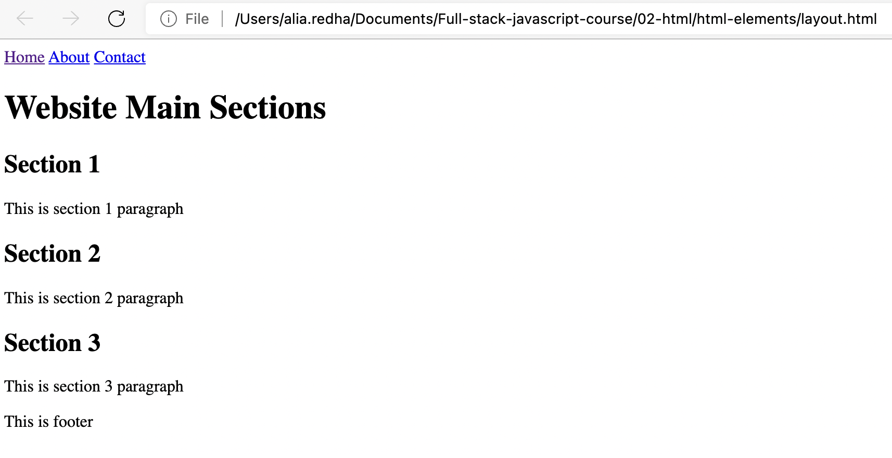
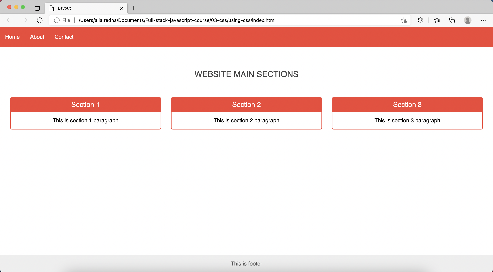
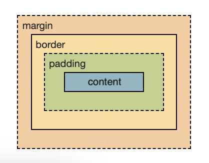
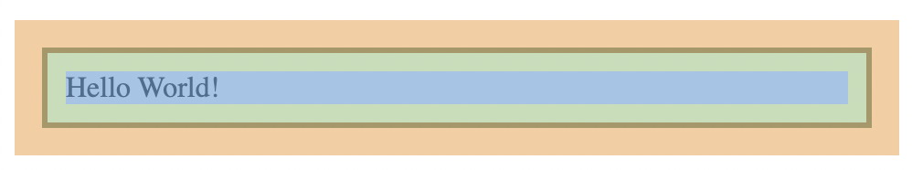
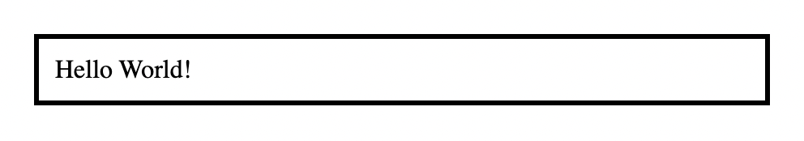

# CSS

In the previous lesson we talked about the languages which are used in front-end development. To refresh your memory, the languages are:

* **HyperText Markup Language (HTML)**: is used for building the page layout and adding content to the web page such as texts, images, audios, videos, tables, forms, hyperlinks, and buttons. HTML is not considered a programming language, instead it is know as a markup language.

* **Cascading Style Sheet (CSS)**: is used for styling the web page by fixing the spacing between the page elements, changing the text type, size and colour, changing the background colours of the different sections and arranging the the elements in more proper positions on the page. CSS is also not considered a programming language.

* **JavaScript**: is a programming language used to make the web page interactive. Meaning, user can interact with the elements in the page and perform actions on them such as showing a popup window when the user click on a button on the page.

We already covered the basics of the HTML language in the previous lesson. In this lesson you will learn the basics of the CSS language.

## Current CSS version

The current CSS version is 3.

## How to add CSS to HTML documents

The first thing we need to learn when we want to use CSS is how and where the CSS code can be added.

There are three ways of adding CSS code:

* **Inline CSS**: You can use the HTML `style` attribute to add styling to a specific element.

* **Internal CSS (Embedded)**: You can use the `<style>` element, which is placed inside the `<head>` element of the HTML document to include the CSS code.

* **External CSS (CSS file)**: You can place the CSS code in a separate file which has the extension `.css`.

### Example of using inline CSS:

```html
<p style="color: red;">This text color is red</p>
```

Notice how we used the `style` attribute to add a css code to the paragraph element.

### Example of using internal CSS:

```html
<!DOCTYPE html>
<html>
<head>
    <meta charset="utf-8">
    <title>My Website</title>
    <style>
        body {
            background-color: yellow;
        }
    </style>
</head>
<body>
    <p>this is a paragraph</p>
</body>
</html>
```

Notice how we placed the CSS code inside the `<style>` element.

### Example of using external CSS:

`index.html` file:
```html
<!DOCTYPE html>
<html>
<head>
    <meta charset="utf-8">
    <title>My Website</title>
    <link rel="stylesheet" href="style.css">
</head>
<body>
    <p>this is a paragraph</p>
</body>
</html>
```

`style.css` file:
```css
body {
    background-color: yellow;
}
```

Notice how we created a file called `style.css` to contain the CSS code, and how we used the `<link>` element to link the `style.css` file to the `index.html` file.

> This is the recommended way of adding CSS to your website.

## Understanding the CSS syntax

The CSS rule consists of:

* selector
* declaration block

Take for example the following rule:

```css
body {
    background-color: yellow;
}
```

The `body` is the selector. The selector is used to specify the element that we want to style. In our example it is the `<body>` element.

The curly braces `{ }` indicates the beginning and the end of the **declaration block**. One or more declarations can be placed inside the declaration block. In our example, we are using one declaration which makes the background colour of the `<body>` element yellow.

> Notice that when you use the inline CSS method to style an element, you don't need the selector (or the curly braces), because you are adding the style directly to the element. However, when you use the internal or the external method to style your elements, you have to use the selector to specify which element you want to style.

Also, you might noticed that the declaration has two parts:
* The first part is called the **property**.
* The second part: is called the **value**.

In our example, the property we are using is `background-color`, and the value is `yellow`.

> Color in background-color is not spelled wrong. This is how it is written in CSS.

Let's take another example. Imagine you hav a paragraph element and you want to make the size of the text 16px and the color of the text gray. This is how you would write the CSS rule for that:

```css
p {
    font-size: 16px;
    color: gray;
}
```

The code is probably self explanatory.

> Don't forget the semi-colon (`;`) after each declaration.

## CSS Selectors

So far, you have been shown some examples in which element tag names were used to specify the element that we want to style. For example:

```css
p {
    font-size: 16px;
    color: gray;
}
```

In this example we used `p` as a selector to specify the `<p>` element as the element that we want to style.

However, imagine that you have two paragraphs in your web page, and you want to make the text of the first paragraph gray, while keeping the text of the other paragraph unchanged (black). You can't do that using the tag name (`p`) as a selector, because if you do so, the style will be applied on both paragraphs, and the text of both paragraphs will be gray.

This is why there are different types of selectors in CSS. The main selectors in CSS are:

* **Type selector**: means using the tag name as a selector.

* **Id selector**: means using the element's ID as a selector.

* **Class sector**: means using the element's class as a selector.

> In addition to these selectors there are also the universal selector (`*`), and the attribute selector (e.g. `input[type="text"]`), but we are not going to focus on them at the moment.

### Id and class

In the HTML lesson we talked about HTML attributes and showed you some examples of the HTML attributes. We also told you in this lesson that you can use the `style` attribute to add inline CSS code to the HTML elements. For example:

```html
<p style="color: red;">This text color is red</p>
```

Id and class are also HTML attributes. These attributes, as well as the style attribute, are global attributes. Meaning, they can be used on any HTML element.

* The `id` attribute is used to add an ID to the element.
* The `class` attribute is used to add a class or a bunch of classes to the element.

Example of using `id` attribute:

```html
<p id="paragraph-1">This is a paragraph</p>
```

Example of using `class` attribute:

```html
<p class="paragraph-1">This is a paragraph</p>
```

You can use more than one class as well:

```html
<p class="class-1 class-2 class-3">This is a paragraph</p>
```

> You can use any name as an ID or a class (even a single letter is a valid name). However, the name must begin with a letter and must not contain spaces. This is why we used the dash `-` instead of the space in our examples. When you use multiple classes you must separate classes with spaces as shown in the last example.

### Example of id selector:

In CSS, you use hash (`#`) to identify the IDs. For example, if you want to style the following paragraph by changing the text colour to gray:

```html
<p id="p1">This is a paragraph</p>
```

You would write your CSS as following:

```css
#p1 {
    color: grey;
}
```

### Example of class selector:

In CSS, you use dot (`.`) to identify the classes. For example, if you want to style the following paragraph by changing the text colour to gray:

```html
<p class="p1">This is a paragraph</p>
```

You would write your CSS as following:

```css
.p1 {
    color: grey;
}
```

### Important note about IDs

Keep in mind when you use the `id` attribute that IDs must be unique. Meaning, that you can't use the same ID on more than one element in the same HTML document. However, you can use class names repeatedly on the same document with no issues.

### Multiple selectors

If you want to make the text of two different elements gray, you can obviously do that using the following code:

```css
h1 {
    color: gray;
}

p {
    color: gray;
}
```

However, you can achieve the same result using the following code:

```css
h1, p {
    color: gray;
}
```

Notice how we used the comma (`,`) to separate between the two selectors.

## CSS Combinators

In HTML lesson we talked about the concept of nested elements (elements put inside each others), and described the relationship using words like child and parent. CSS combinators are used to select elements based on these kinds of relationships.

These combinators are:

* **Adjacent sibling combinator**: A + B

    For example to select all paragraphs that come immediately after any image:

    ```css
    img + p {
        font-weight: bold;
    }
    ```

* **General sibling combinator**: A ~ B

    For example to select all paragraphs that are siblings of and subsequent to (not necessarily immediately after) any image:

    ```css
    img ~ p {
        color: red;
    }
    ```

* **Child combinator**: A > B

    For example to select list items that are direct children of the "my-list" list:

    ```css
    .my-list > li {
        margin: 2em;
    }
    ```

* **Descendant combinator**: A B

    For example to select list items that are descendants (not necessarily direct children) of the "my-list" list:

    ```css
    .my-things li {
        margin: 2em;
    }
    ```

It is totally fine if you don't fully understand how to use these combinators at the moment. You will get used to using them and learn more about them with time.

## What you can do with CSS

We don't want to continue talking about theoretical concepts without showing you a practical example of using CSS to apply simple styling on a simple web page.

Go to your `full-stack-js-course` which you created previously and inside of it create a new folder called `using-css`. Now, open the `using-css` folder in VSCode.

Add a new file to the folder called `index.html`. We will use the following HTML code from the previous lesson in this example (with a very simple modification):

```html
<!DOCTYPE html>
<html>
<head>
    <meta charset="UTF-8">
    <title>Layout</title>
    <link rel="stylesheet" href="style.css">
</head>
<body>
    <header>
        <nav>
            <a href="index.html">Home</a>
            <a href="about.html">About</a>
            <a href="contact.html">Contact</a>
        </nav>
    </header>

    <main>
        <h1>Website Main Sections</h1>

        <div id="main-sections">
            <section>
                <h2>Section 1</h2>
                <p>This is section 1 paragraph</p>
            </section>
    
            <section>
                <h2>Section 2</h2>
                <p>This is section 2 paragraph</p>
            </section>
    
            <section>
                <h2>Section 3</h2>
                <p>This is section 3 paragraph</p>
            </section>
        </div>
    </main>

    <footer>
        <p>This is footer</p>
    </footer>
</body>
</html>
```

Open the file in your browser and hove a look on how it looks before we add the CSS code:



Now create a new file called `style.css`. This is going to be our CSS file, so we need to link this file to the `index.html` file. We will use the external CSS method as we learned before to link the file, so in the `index.html` add a `<link>` element that refers to the `style.css` file inside the `<head>` element as following:

```html
<head>
    <meta charset="UTF-8">
    <title>Layout</title>
    <link rel="stylesheet" href="style.css">
</head>
```

Finally, add the following CSS code inside the `style.css` file:

```css
body {
    margin: 0;
    display: flex;
    flex-direction: column;
    min-height: 100vh;
    font-family: sans-serif;
}

header {
    background-color: #f44336;
}

header nav {
    display: flex;
}

header nav a {
    text-decoration: none;
    padding: 20px 15px;
    color: white;
}

main {
    padding: 50px 15px;
    flex-grow: 1;
}

main > h1 {
    font-size: 1.5rem;
    text-align: center;
    text-transform: uppercase;
    padding-bottom: 20px;
    border-bottom: 1px dashed #f44336;
    color: #444;
    font-weight: 500;
}

#main-sections {
    display: flex;
}

#main-sections > section {
    flex-grow: 1;
    text-align: center;
    margin: 15px;
    border: 1px solid #f44336;
    border-radius: 5px;
    overflow: hidden;
}

#main-sections > section > h2 {
    background-color: #f44336;
    color: #fff;
    margin: 0;
    padding: 10px;
    font-size: 1.25rem;
    font-weight: 400;
}

footer {
    background-color: #EEE;
    border-top: 1px solid #DDD;
}

footer > p {
    text-align: center;
    color: #555;
}
```

Now save the file and refresh the page to see how it looks now:



As you can see with using only a few CSS properties we dramatically changed the page look. In this lesson and the next lesson you will learn about all these properties and much more other properties which you will be using to create amazing web pages.

## Text styling

Let's start our journey in CSS by learning the important CSS properties that we frequently use to style texts in web pages. We used some of these properties in the previous example (`font-size`, `font-family`, `font-weight`, `text-decoration`, `text-align`, `text-transform` and `color`). Of course there are more, but let's for now focus on these ones.

* **font-size**: is obviously used to control the size of the text. 

    You might noticed that I used a unit called `rem` to define the size of the text. There are a bunch of other units that you can use to define the size of the text such as `px`, `%`, and `em`. There are also what is called the absolute-size values such as `small`, `medium`, `large`, `x-large` ... etc. What I am trying to tell you here is that in CSS there are many ways to define sizes (not only of texts but also other things like the heights and widths of elements). You don't have to learn or use all of them. It is also fine to stick to one or two ways (for example `px` and `%`) in the beginning, and then learn more on the way.

* **font-family**: is used to set the font type. Browsers only support a few font families, but you can always use your own fonts by adding them to the project. You can also choose fonts from websites like https://fonts.google.com/. You might want to search the web to learn how to use custom fonts in your website.

* **font-weight**: this property accepts values such as `normal` and `bold`, as well as numeric values (100, 200, 300 ... 900). The 400 is equivalent to  `normal`, and the 700 is equivalent to the `bold`. So, numbers greater than 700 represent weights greater than `bold` and numbers less than 400 represent weights less than normal.

* **font-style**: this property accepts three values: `normal`, `italic` or `oblique`. This is the property you should use if you want to make the text italic.

* **text-decoration**: accepts the values: `overline`, `line-through`, or `underline`. You can also use `none` to remove the text-decoration. For example, in the previous code I used `text-decoration: none;` to remove the default underline from the `<a>` element.

* **text-align**: accepts the values: `start`, `end`, `left`, `right`, `center`, `justify`, or `match-parent`. The `start` and `end` are similar to `left` and `right` but they align the text based on the page direction (page direction could be left to right like in English-based pages, or right to left like in Arabic-based pages). This is using `start` and `end` could be better than using `left` and `right`.

* **text-transform**: is a shortcut property for four properties:
    * **text-decoration-line**: Sets the kind of decoration used, such as `underline` or `line-through`.
    * **text-decoration-color**: Sets the color of the decoration.
    * **text-decoration-style**: Sets the style of the line used for the decoration, such as `solid`, `wavy`, or `dashed`.
    * **text-decoration-thickness**: Sets the thickness of the line used for the decoration.

    An Example of setting all these properties:

    ```html
    <p class="decorated-text">This is a decorated text</p>
    ```

    ```css
    .decorated-text {
        text-decoration: underline red wavy 2px;
    }
    ```
    This will look like:

    

* **color**: is used to set the font color.

## Pseudo-classes

You might have noticed that some of the websites that you have visited contains hyperlinks that when mouse curser goes over them change their text color. Sometimes, they also change their color permanently when you visit their page (for example from blue to purple to let you know that you have already visited the page). All these effects and more are done using what are know as **CSS pseudo-classes** (pronounced "su-do classes").

Pseudo-classes are not exclusively used with hyperlinks, they can be used with any element. For example, you might noticed that some e-commerce websites enlarge the product image or show you some icons (add to wishlist, add to cart ... etc.) when you move the mouse cursor over the the product. This is also done with CSS pseudo-classes.

Consider the following examples:

```css
/* unvisited link */
a:link {
    color: tomato;
}

/* visited link */
a:visited {
    color: tomato;
}

/* mouse over element */
div:hover {
    color: tomato;
} 

/* selected link */
a:active{
    color: #0000FF
}
```

> In the HTML lesson, we talked about comments and the advantage of using them. The proceeding CSS code contains CSS comments. As you can see you can add comments in CSS using this syntax: `/* you comment ... */`.

Another use of pseudo-classes in CSS is similar to CSS combinators. They allow you to select elements based on the nesting relationships described before.

consider the following example:

```html
<div>
    <p>This is a bold text</p>
    <p>This is a normal text</p>
    <p>This is a red text</p>
</div>
```

```css
div p:first-child {
    font-weight: bold;
}

div p:last-child {
    color: red;
}
```

## Background

You can change he background color of the element using the `background-color` property or the shortcut property `background`.

```css
div {
    background: red;
}
```

You can also use the `background` property to set an image as a background of the element. In most scenarios you want the image to be centered and cover the whole element area. A CSS code you can use to achieve this is:

```css
div {
    background: url(images/bg.jpg) no-repeat center center;
    background-size: cover;
}
```

The `images/bg.jpg` represents the path to the image file.

To set the image as the website background and make it fixed (does not move when page is scrolled), you add the `fixed` value to the previous code as following:

```css
.div {
    background: url(images/bg.jpg) no-repeat center center fixed;
    background-size: cover;
}
```

## CSS Box Model

In the previous CSS example I used some properties that are related to the CSS box model including: `min-height`, `margin`, `padding`, `border` and `border-radius`.

The box model is defined by four layers:



The corresponding CSS properties are:

* **border**: is a shortcut for three properties:
    * border-color
    * border-style
    * border-width

    This property allows you to add a border around the element. Fro example:

    ```html
    <p>this paragraph has a border around it.</p>
    ```
    
    ```css
    /* border-color: black, border-style: solid, border-width: 1px */
    p {
        border: black solid 1px;
    }
    ```
    
    However, if you want to add the border to only one side of the element (like I did in the previous example) you can use: `border-top`, `border-bottom`, `border-left` or `border-right`.

    You can also use a property called `border-radius` to make the element corners rounded or to make the element circle-shaped. For example:

    ```css
    /* make element corners rounded */
    .element {
        border-radius: 5px;
    }

    /* make element circle-shaped */
    .element {
        border-radius: 50%;
    }
    ```

* **margin**: refers to external space area. This property can be used as a shortcut for the properties: `margin-top`, `margin-bottom`, `margin-left` and `margin-right`. For example:

    ```css
    /* add a margin of 5px around the element */
    .element {
        margin: 5px;
    }

    /* add a margin of 10px to the top and the bottom */
    .element {
        margin: 10px 0;
    }

    /* add a margin of 8px to the top and the bottom and 16px to the left and the right */
    .element {
        margin: 8px 16px;
    }

    /* add a margin of 5px to the top 10px to the right 15px to bottom and 20px to the left*/
    .element {
        margin: 5px 10px 15px 20px;
    }
    ```

    > By default, browsers add a margin of 8px to the `<body>` element. You can get rid of that by setting the the margin of the `<body>` element to 0.

    ```css
    body {
        margin: 0;
    }
    ```

* **padding**: refers to internal space area. Same margin rules applies to padding. For example:

    ```css
    /* add a padding of 5px around the element */
    .element {
        padding: 5px;
    }

    /* add a padding of 10px to the top and the bottom */
    .element {
        padding: 10px 0;
    }

    /* add a padding of 8px to the top and the bottom and 16px to the left and the right */
    .element {
        padding: 8px 16px;
    }

    /* add a padding of 5px to the top 10px to the right 15px to bottom and 20px to the left*/
    .element {
        padding: 5px 10px 15px 20px;
    }
    ```

## Box model example

Consider the following `<div>` element, which has `border`, `padding` and `margin` applied to it:

```html
<div class="box-model-example">Hello World!</div>
```

```css
.box-model-example {
    border: black solid 3px;
    margin: 15px;
    padding: 10px;
}
```



As you can see:

* the `content` is the area that contains the text (the blue area).
* the `padding` is the space area that surrounds the content area (the green area).
* the `margin` is the external space area that surrounds the element (the orange area).

The colors used in this example to highlight these areas are for illustration purposes only. The areas will appear without these colors on the page:



## Height and width

In addition to `padding`, `margin` and `border`, you can control the height and the width of the box model using `height`, `width`, `min-height`, `min-width`, `max-height` and `max-width` properties.

* min: refers to minimum.
* max: refers to maximum.

The previously mentioned properties (`height`, `width`, `min-height`, `min-width`, `max-height` and `max-width`) can be used only with **block elements** or **inline-block** elements (we will talk about inline-block elements later). They can't be used with **inline elements**.

By default, the **block elements** in HTML, such as `<div>`, `<p>`, `<h1>` ... etc, has a height of 0 and a width 100% of parent width if they were empty (have no content). Once you add content (such as a text or other elements) inside of them, they start to take the height of their content.

You can use the previously mentioned properties to define the width and the height of the element regardless of their content size.

## Box-sizing

However, the sizes of width and height rely on a property called `box-sizing`. Based on the value of `box-sizing` you determine whether to calculate the border-width and the padding as parts of the box width and height or not. 

The `box-sizing` property accepts two main values: `content-box` or `border-box`.

* content-box: is the default value of `box-sizing` and does not calculate the border-width and padding as parts of the width and the height of the element.

* border-box: is the preferred options for most developers because it includes the border-width and padding when it calculates the width and the height.

You can force all elements to use `border-box` instead of the default `content-box` by adding the following rule to your CSS:

```css
*, *::before, *::after {
    box-sizing: border-box;
}
```

> The `*` is called the universal selector and it is used to select all elements. The `::before` and `::after` are called pseudo-elements and you don't need to worry about them just yet.

Kevin Powell has an excellent video on his Youtube channel explaining the idea of box-sizing. Here is the link of the video: https://www.youtube.com/watch?v=WlGQdgy-M6w&ab_channel=KevinPowell

## The overflow property

What happens when you define specific height and width for an element, and then you put a content which has a size larger that the element itself? 

By default, the content will go outside the area of the element.

You can control that using the `overflow` property. You can also be more specific by using `overflow-x` (to control the overflow horizontally) or `overflow-y` (to control the overflow vertically). 

The available options are: 

* `visible` (which is the default)
* `hidden` (which hides the extra content)
* `scroll` (which adds scroll bars)
* `auto` (which adds the scroll bars only if the content is larger than the element)

## The display property

The `display` property has many uses. Building the website layout rely essentially on this property, so it is important to spend enough time learning the different options that this property has.

We will learn later how to apply the responsive website concept (a website that looks different on different screen sizes) using CSS rule called **media query rule**. In responsive designs you usually show and hide elements based on the size of the screen. The `display` property allows you to hide elements by setting its value to `none`.

```css
.hidden-element {
    display: none;
}
```

It also allows you to change the `block` element to `inline` or `inline-block` element and vice-versa. For example:

```css
div {
    display: inline;
}
```

One option to list block elements (such as `<div>`) in one line is to make them `inline` elements as shown in th example. However, inline elements don't respond properly to padding and margin. You also can't control their height or width because `height` and `width` properties don't work on inline elements. So, one solution that CSS provides us with to deal with this issue is `inline-block`.

```css
div {
    display: inline-block;
}
```

However, even `inline-block` is not the right answer for most scenarios. For example, it might leave small gabs between the elements. Therefore, CSS provides more adequate solutions which we will cover in the next lesson.
