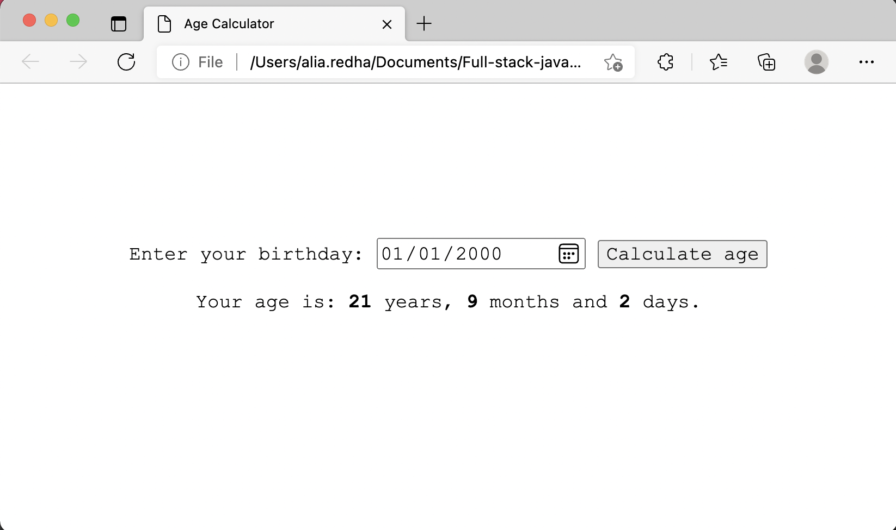
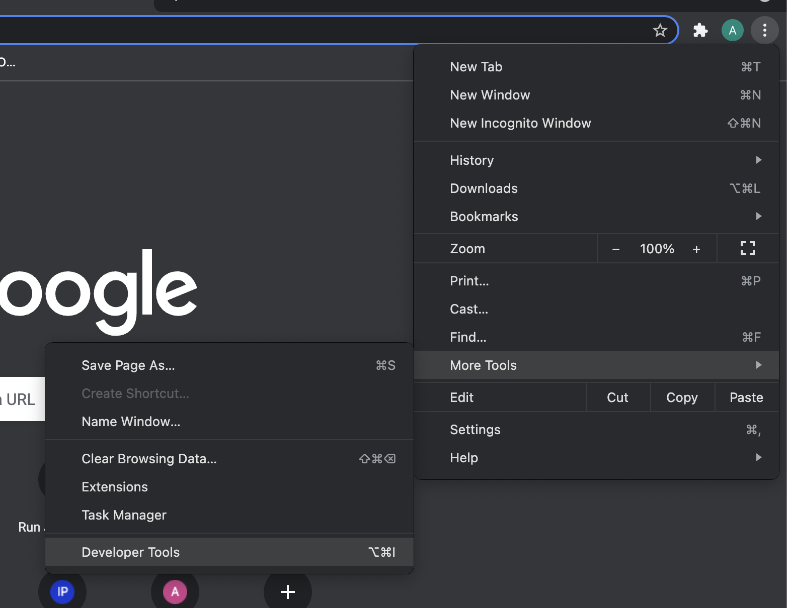
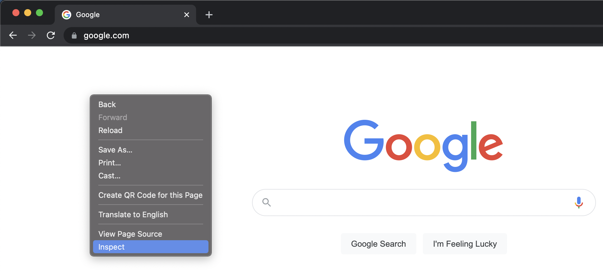
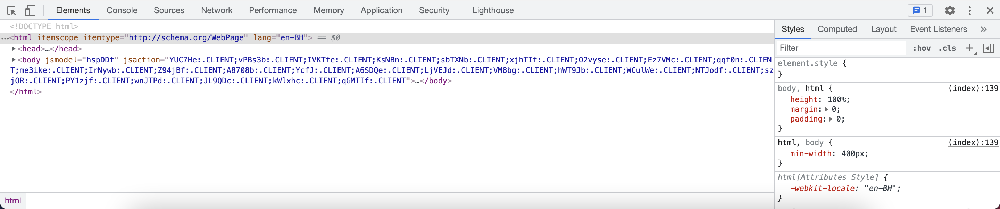
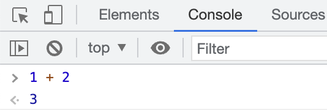

# JavaScript

We talked previously about the languages which are used in front-end development. To refresh your memory, the languages are:

* **HyperText Markup Language (HTML)**: is used for building the page layout and adding content to the web page such as texts, images, audios, videos, tables, forms, hyperlinks, and buttons. HTML is not considered a programming language, instead it is know as a markup language.

* **Cascading Style Sheet (CSS)**: is used for styling the web page by fixing the spacing between the page elements, changing the text type, size and colour, changing the background colours of the different sections and arranging the the elements in more proper positions on the page. CSS is also not considered a programming language.

* **JavaScript**: is a programming language used to make the web page interactive. Meaning, user can interact with the elements in the page and perform actions on them such as showing a popup window when the user click on a button on the page.

We already covered the basics of the HTML and CSS in the previous lessons. In this lesson you will learn the basics of the JavaScript language.

## Adding JavaScript to your website

There are two ways of adding JavaScript to websites:

* **Internal script**: by adding the script inside the `<script>` element.
* **External script**: by putting the script in a separate file the has the extension `.js`.

Example of using internal script:

```html
<html>
<head>
    <meta charset="UTF-8">
    <title>My Website</title>
</head>
<body>
    <h1>Hello world</h1>

    <!-- internal script -->
    <script>
        /* JavaScript code goes here ... */
    </script>
</body>
</html>
```

Example of using external script:

Let's imagine that we have a file called `my-script.js` which contains JavaScript code, and we want to link this file to the HTML document. We would do that as following:

```html
<html>
<head>
    <meta charset="UTF-8">
    <title>My Website</title>
</head>
<body>
    <h1>Hello world</h1>

    <!-- external script -->
    <script src="my-script.js"></script>
</body>
</html>
```

Notice how we used the `src` attribute to define the path to the script file.

## Interactive web page example

Let's start this lesson by showing you a real example of an interactive we page. We are going to create a simple JavaScript app that calculates age based on date of birth.

Go to your `full-stack-js-course` which you created previously and inside of it create a new folder called `age-calculator`. Now, open the `age-calculator` folder in VSCode.

Add three new files to the folder, and name them as following: `index.html`, `style.css` and `script.js`.

Add the following HTML code to the `index.html` file:

```html
<!DOCTYPE html>
<html>
<head>
    <meta charset="UTF-8">
    <title>Age Calculator</title>
    <link rel="stylesheet" href="style.css">
</head>
<body>
    <!-- Age calculator form -->
    <form>
        <label>
            Enter your birthday: 
            <input id="dob" type="date">
        </label>
        <button type="button">Calculate age</button>
    </form>

    <!-- result viewer -->
    <div id="resultViewer"></div>

    <!-- page script -->
    <script src="script.js"></script>
</body>
</html>
```

Add the following CSS code to the `style.css` file:

```css
* {
    box-sizing: border-box;
}

body {
    margin: 0;
    min-height: 100vh;
    display: flex;
    flex-direction: column;
    justify-content: center;
    align-items: center;
    font-size: large;
    font-family: 'Courier New', Courier, monospace;
}

label, input, button, body > div {
    font-size: inherit;
    font-family: inherit;
}

#resultViewer {
    padding: 20px;
    min-height: 100px;
}
```

Add the following JavaScript code to the `script.js` file:

```js
var calcAgeBtn = document.querySelector('form > button');
var resultViewer = document.getElementById('resultViewer');

function getAge(dob) {
    // calculate difference in milliseconds
    var dobInMilliSeconds = Date.parse(dob);
    var nowInMilliSeconds = Date.now();
    var differenceInMilliSeconds = nowInMilliSeconds - dobInMilliSeconds;

    // calculate years
    var yearsDivider = 1000 * 60 * 60 * 24 * 365.25;
    var years = Math.floor(differenceInMilliSeconds / yearsDivider);
    var yearsRemainder = differenceInMilliSeconds % yearsDivider;

    // calculate months
    var monthsDivider = 1000 * 60 * 60 * 24 * (365.25 / 12);
    var months = Math.floor(yearsRemainder / monthsDivider);
    var monthsRemainder = yearsRemainder % monthsDivider;

    // calculate days
    var daysDivider = 1000 * 60 * 60 * 24;
    var days = Math.floor(monthsRemainder / daysDivider);

    return [years, months, days];
}

function displayAge() {
    var dob = document.getElementById('dob').value;

    var dobInMilliSeconds = Date.parse(dob);
    var nowInMilliSeconds = Date.now();

    if (dobInMilliSeconds > nowInMilliSeconds) {
        alert('Date of birth cannot be greater than current date!')
    } else {
        // call getAge to calculate the age
        var [years, months, days] = getAge(dob);

        resultViewer.innerHTML = `Your age is: <strong>${years}</strong> years, <strong>${months}</strong> months and <strong>${days}</strong> days.`;
    }
}

// call displayAge function when user click on
// the Calculate age button
calcAgeBtn.addEventListener('click', displayAge)
```

Now open the `index.html` file in the browser and test the age calculator by entering your age and clicking on the "Calculate age" button.



You have to understand that the code is no more than a set of instructions that you want the computer to follow and execute. Programming languages allow you to write these instructions in a way a computer can understand. This includes using the tools that programming languages provides us with like `variables`, `functions`, ... etc.

> You might noticed from the example that we can use `//` to write comments in JavaScript code.

## introduction to programming

In this lesson, you are going to learn the programming fundamentals. 

You are going to learn about:

* `variables` and different data types that you can store with variables.
* `functions` and how they allow you to divide your code into manageable routines (pieces of code) and make the code more readable and re-usable.
* `if statements` and `switch statements` to execute code conditionally.
* different types of `loops` that allow you to execute a piece of code multiple times.
* `objects` to encapsulate related `variables` and `functions` and represent them as a single piece of data.

### Computer components

Before we start learning how to program, we must first know how computers work, because as I said, codes are just instructions for computer to execute.

Computer systems are usually built of the following components:

* Motherboard
* CPU (Central Processing Unit)
* GPU (Graphics Processing Unit)
* Memory (Random Access Memory (RAM))
* Hard drive (storage device)
* Input devices: such as keyboard, mouse, touch-pad, touchscreen, camera, microphone ..etc.
* Output devices: such as screen, speakers ... etc.

The motherboard is responsible for connecting the different computer components together and transmitting data between these components. 

The CPU is the brain of the computer. It is responsible for processing the data coming from the input devices and sending the processed data to the storage devices or the output devices. 

The GPU is responsible for processing the graphical data such as images and videos.

Both the memory and the hard drive are used to store data. However, there is an important difference between the two. 

When you run a program in your computer, the data which is needed to run the program is loaded from the hard drive to the memory, and when you close that program, all related data are removed from the memory.

There is a good reason for that. Processors (CPUs) are super fast. They process data in a speed that hard drives can't keep up with. The memory, on the other hand, can read and write data really fast compared to hard drives. This is why we store the data that is going to be processed by the processor in the memory, However, RAMs are more expensive than hard drives, and as a result are not good for storing large  data such as operating system files, programs files, and user files. This is why hard drives are used to store these files.

### Communicating with a computer

Examples of tasks a computer can perform include:

* reading or storing data from and to the hard drive.
* adding or removing data to and from the memory.
* performing logical or arithmetical operations.
* converting binary data into images or a videos to display them on the screen.

We use the input devices to send instructions to the CPU to perform these tasks. These instructions must be represented in binary as (0s an 1s), because the computer can't understand anything except 0 (low electric voltage signal) and 1 (high electric voltage signal).

However, writing programs in binary does not sound reasonable, isn't it? This is why high-level languages were created. You write your code (instructions) in a humanly-readable way, and later a compiler or an interpreter is used to convert the code to the language that the computer can understand (binary)

### Types of programming language

There are two main types of programming languages:

1. **High-level programming languages**: are humanly readable languages but can't be directly understood by a computer. They need to be converted into machine language.
    * include: JavaScript and most programming languages.
2. **Low-level programming languages**: are used to directly communicate with the computer hardware. These languages are:
    * Assembly language
    * Machine language (binary)

When you develop a program, you normally develop it to run on some operating system such as Windows, MacOS, Linux, or a mobile operating system such as iOS or Android. Therefore, you will never need to use Low-level programming languages. Your program normally tell the operating system what should be done, and the operating system translate that to the CPU using the low-level languages.

Sometimes you develop a program which isn't run directly by the operating system, but instead by another program. The front-end development is a good example of that, because the website or the web applications that you are going to develop are meant to be run by another program called the **browser**. In this case, the instructions are passed from your application to the browser, and from the browser to the operating system, and finally from the operating system to the CPU.

> JavaScript can be used as a front-end language as well as a back-end language. When it is used as a front-end language, it is run inside the browser and executed by the browser. However, when it is used as a back-end language it runs outside the browser and used to communicate directly with the operating system as you will see in the node js chapter.

To summarize: we as programmers, use high-level languages such as JavaScript to communicate either directly with the operating system or through other programs run by the operating system.

## JavaScript as a front-end language

When it comes to front-end, JavaScript is used to create interactive web pages. You can easily see that in the previous example (the age calculator). When the user clicks on the "Calculate age" button, JavaScript reads the the date of birth entered by the user and use it to calculate the user age and finally display the result in an HTML div. This kind of interactivity between the user and the web page can't be achieved without JavaScript.

## Browser Developer Tools

The browser developer tools (aka devtools) are a set of tools available in all modern browsers. These tools do a range of things, from inspecting currently-loaded HTML, CSS and JavaScript to showing which assets the page has requested and how long they took to load. 

There are several way to open the devtools. For example:



Another way is by right-clicking the web page and selecting "inspect":



Or you can use the keyboard shortcuts: `option` + `command` + `I` on Mac, or `Ctrl` + `Shift` + `I` on Windows (for Internet Explorer or Edge the shortcut is `F12`).

The devtools look like this:



On the "Elements" tab, you can see the page HTML code on the left side, and the page CSS code on the right side. You can use this tab to inspect the HTML code, make temporary modifications on the page to see how it would look, ... etc.

Next to the "Elements" tab, resides the "Console" tab. The console is the place where log messages appear. These messages include errors, warnings, network requests and developer-generated logs. You can also run JavaScript commands in the console. For example:



Next is the "Sources" tab, which you can use to debug JavaScript code. You will lear about code debugging later in this course.

Next comes the "Network" tab, which is used to see what resources are loaded by the page and how long time each resource is taking to be loaded.

Another important tab is the "Application" tab, which you can use to view information stored in Local Storage, Session Storage, and cookies.

## Your first JavaScript code

In programming we used to build what is called the "Hello world" application. The purpose of the "Hello world" application is to show you how you can use the programming language to print a simple sentence on the screen.

We will use the "Console" to print the "Hello world".

Create a new folder in the `full-stack-js-course` folder and name it `hello-world` and open it in VSCode.

Add a new file to the folder called `index.html`. We will use internal script this time to add our script to the page.

Add the following code to the `index.html` file:

```html
<!DOCTYPE html>
<html lang="en">
<head>
    <meta charset="UTF-8">
    <title>Hello world</title>
</head>
<body>
    <script>
        console.log("Hello world");
    </script>
</body>
</html>
```

Now open the file in the browser and go to the "Console" and you should see the "Hello world" printed in the console.

## Data types in JavaScript

The first thing you should learn when you learn any programming language is the data types that can you use in the language. Data types are usually categorized in two categories:

1. primitive data types
2. composite data types

The composite types are constructed of the primitive types. So, first we must learn the primitive data types to be able to learn the composite data types.

### Primitive data types

JavaScript primitive data types include:

* **string**: a sequence of one or more characters, wrapped between double-quotes, single-quotes, or backticks:
    * Single-quotes example: `'hello'`
    * Double-quotes example: `"hello"`
    * backticks example: `` `hello` ``
* **number**: could be integer or decimal number, and could be positive or negative.
    * Examples include: `1`, `10`, `-5`, `0.5`, `-0.25` ... etc.
* **boolean**: `true` or `false`
* **null**: represents the absence of an object value.
* **undefined**: simply means "there is no value".
* **symbol**: an example of a symbol is an object property name.

> You will learn about objects in the composite data types section of this lesson.

### Composite data types

In JavaScript all composite types are objects. However, there are two main types of these objects:

1. object: is a collection of values associated with keys.
2. array: is a collection of values associated with integer-based auto-incremented keys.

Object example:

```js
{ firstName: "John", lastName: "Doe", age: 18, isMarried: false }
```

This object for example has four properties. The first property is `firstName` and the value of this property is `"John"`. The second property is `lastName` and its value is `"Doe"`, and so on.

> Notice that you use curly braces `{ }` to define objects.

Array examples:

```js
// array of prime numbers
[2, 3, 5, 7, 11]

// array of names
["Adam", "Noah", "David", "Mary", "Joseph"]

// array of random values
["Hello", true, 10, null, -5, undefined]
```

In array, keys are integers starting from 0 and increment by one for each item added to the array. So, if an array has five items, the first item key will be 0 and the last item key will be 4.

> Notice that you use square brackets `[ ]` to define arrays.

## Variables in JavaScript

Variables allow you to store the previously mentioned data types in computer memory with names that are used as references for those values. For example:

```js
var name = "Mohammed";
```

In this line of code, we are creating a variable called `name`, and we are assigning the value `"Mohammed"` to this variable. The value `"Mohammed"` is now stored in the memory, and the variable `name` can be used to refer to this value in the memory.

For example, if you want to get the value `"Mohammed"` from the memory and print it in the "Console" you would do something like:

```js
console.log(name)
```

This line will print `Mohammed` in the console.

You can assign any of the previously mentioned data types to a variable.

The equal sign `=` is called assignment operator, because it is used to assign values to variables.

### declaring variables

To define (declare) a variable you use the `var` keyword.

For example:

```js
var x;
```

`x` in this example is a variable, even through it has no value assigned to it. When you log this variable to console, the console will print `undefined` which as mentioned before means "there is no value".

```js
console.log(x) // console will print: undefined
```

You can name your variables whatever you want, however there are some rules you should follow when naming variables such as not beginning the variable name with a number or a symbol character.

### Why we use variables

In programming, variables can be used as placeholders for values. These values might be data entered by a user. In the "Age calculator" example we declared a variable called `dob` to refer to the date of birth entered by the user. 

```js
var dob = document.getElementById('dob').value;
```

We don't know what date will be entered by the user, but whatever the date is, we can refer to it using the `dob` variable.

To see more examples of using variables, check out the "Age calculator" example.

### Using typeof to check types

You can use the `typeof` operator to check the type of a value or a variable. For example:

```js
var x = "Hello";

console.log(typeof x); // console will print: string
```

## Arithmetic Operators

In programming, it is important to be able to perform arithmetic operations such as addition, subtraction, multiplication, division ... etc. Can you imagine building an application for a financial company like a bank or an insurance company without being able to do arithmetic operations? This is why programming languages provide a set of operators that you can use to do these kinds of operations.

* `+` operator is used for addition.
* `-` operator is used for subtraction.
* `*` operator is used for multiplication.
* `/` operator is used for division.
* `**` exponentiation operator (to the power of).
* `%` is called the modulus operator and used to get the remainder of a division.

Most of these operators were used in the "Age calculator" example:

```js
var differenceInMilliSeconds = nowInMilliSeconds - dobInMilliSeconds;

// calculate years
var yearsDivider = 1000 * 60 * 60 * 24 * 365.25;
var years = Math.floor(differenceInMilliSeconds / yearsDivider);
var yearsRemainder = differenceInMilliSeconds % yearsDivider;

// calculate months
var monthsDivider = 1000 * 60 * 60 * 24 * (365.25 / 12);
var months = Math.floor(yearsRemainder / monthsDivider);
var monthsRemainder = yearsRemainder % monthsDivider;

// calculate days
var daysDivider = 1000 * 60 * 60 * 24;
var days = Math.floor(monthsRemainder / daysDivider);
```

Let's take it line by line.

```js
var differenceInMilliSeconds = nowInMilliSeconds - dobInMilliSeconds;
```

Here, we are using the `-` operator to subtract the date of birth from the current date.

```js
var yearsDivider = 1000 * 60 * 60 * 24 * 365.25;
```

Here we are using the `*` operator to multiply 1000 by 60 by 60 by 24 by 365.25 to calculate the number of milliseconds exist in one year.

```js
var years = Math.floor(differenceInMilliSeconds / yearsDivider);
```

Here we are using the `/` operator to divide the difference between the date of birth and the current time in milliseconds by a year in milliseconds to get the years part of the user age.

This division might contains a remainder which represents a number of milliseconds less than the milliseconds exist in a year. From this remainder we can calculate the months part of the user age, and so on.

Don't worry if you don't fully understand these examples. All I wanted to prove by using these examples is that even a simple application like the "Age calculator" relies heavily on arithmetic operations, so make sure to remember them and remember how to use them.

## Comparison operators

Another set of important operators which are frequently used in programming are the comparison operators. We use these operators to compare between two values. The result of the comparison is alway a boolean value (either `true` or `false`).

Comparison operator includes: 

* `>`: greater than
* `>=`: greater than or equal to
* `==`: is equal to the value of
* `===`: is equal to the value and the type of 
* `<=`: is less than or equal to
* `<`: is less than
* `!=`: is not equal to the value of
* `!==`: is not equal to the value or the type of

For example:

```js
var isAdult = userAge >= 18;
```

if user age is greater than or equal to 18, the value of `isAdult` will be `true`. However if user age is less than 18, the value of `isAdult` will be `false`.

## Logical operators

There are three logical operators in JavaScript:

* `!`: NOT
* `&&`: AND
* `||`: OR

Let's see how these operators work with examples.

### NOT (!)

Example (1):

```js
var x = true;

console.log(!x); // will print: false
```

Because `x` is equal to `true`, the `!x` will be equal to `false`.

Example (2):

```js
var x = false;

console.log(!x); // will print: true
```

Because `x` here is equal to `false`, the `!x` will be equal to `true`.

### AND (&&)

With `&&` operator, all values in an expression must be equal to `true` for the expression to equal `true`. If only one values in the expression is equal to `false`, then the whole express will be equal to `false.

Example (1):

```js
var a = true;
var b = true;

console.log(a && b); // will print: true
```

As you can see, the expression `a && b` is qual to `true` as both `a` and `b` are equal to `true`.

Example (2):

```js
var a = false;
var b = false;

console.log(a && b); // will print: false
```

In this example, the expression is equal to `false` because `a` and `b` are equal to `false`.

Example (3):

```js
var a = false;
var b = true;

console.log(a && b); // will print: false
```

In this example, the expression is equal to `false` because one of values in the expression is `false` (the value of `a`).

Example (4):

```js
var a = true;
var b = false;

console.log(a && b); // will print: false
```

### OR (||)

With `||` operator, only one of the values in an expression needs to be `true` for the expression to be equal to `true`. Let's see some examples to understand what this means.

Example (1):

```js
var a = true;
var b = true;

console.log(a || b); // will print: true
```

Example (2):

```js
var a = false;
var b = false;

console.log(a || b); // will print: false
```

Example (3):

```js
var a = true;
var b = false;

console.log(a || b); // will print: true
```

## Logical operators and truthy and falsy values

In the previous examples we saw how logical operators work with boolean values (`true` and `false`). However, values can be also `truthy` or `falsy`.

The fallowing values are considered to be `falsy` in JavaScript:

* the boolean value `false`
* the number `0`
* the number `-0`
* the empty string: `""`, `''` or ` `` `
* the `null` value
* the `undefined` value

### Using NOT operator with truthy or falsy values

```js
var x = ""; // x is falsy because it is an empty string
var y = "Ali"; // y is truthy because it is non-empty string

console.log(!x); // will print: true
console.log(!y); // will print: false
```

### Using AND and OR operators with truthy and falsy values

You might think that AND (`&&`) and OR (`||`) operators are also going to be valuated into boolean values. Well, that's not really correct, because this is not how AND (`&&`) and OR (`||`) operators work.

* `x && y`: returns `x` if `x` is `falsy`. Otherwise, returns `y`.
* `x || y`: returns `x` if `x` is `truthy`. Otherwise, returns `y`.

Let's see some examples:

Example (1):

```js
var x; // x here is falsy because it is undefined.
var y = 10; // y is truthy because it is not 0 or -0.

console.log(x && y); // prints: undefined
```

Example (2):

```js
var x = 10; // x is truthy
var y = 15; // y is also truthy

console.log(x && y); // because x is not falsy, it will print: 15
```

Example (3):

```js
var x = "abcd";
var y = 1234;

console.log(x || y); // prints: abcd
```

Example (4):

```js
var x = null;
var y = "Hello";

console.log(x || y); // prints: Hello
```

> Understanding these operators is important. You will see some practical examples when you get to react.js lessons, so make sure to understand them and practice them very well.

## Statements and expressions

In the previous sections of this lesson, we have seen some examples of statements. For example, the following line of code is considered a statement:

```js
var greeting = "Hello world!";
```

A single statements can be in one line or span multiple lines. Also, multiple statements can occur in a single line if each statement is separated by a semicolon (`;`).

All expressions are statements, but not all statements are expressions. For example, all statements that contains the previously mentioned operators (arithmetic operators, comparison operators, and logical operators) are examples of expressions. You will learn about more types of expressions later in this lesson.

